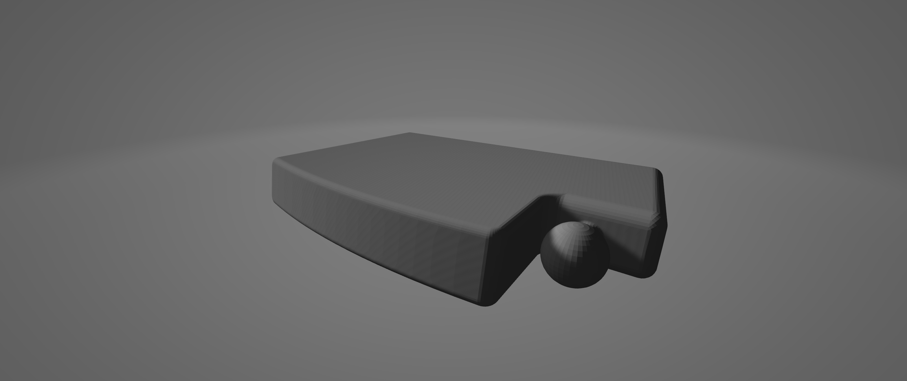
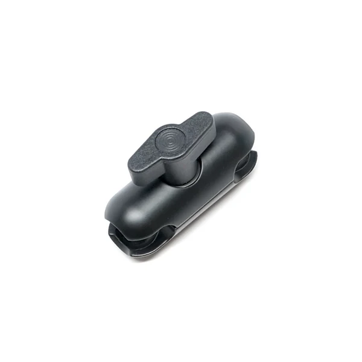
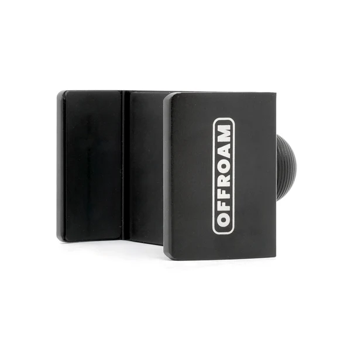

# Car Mount – Double DIN Gap Filler with Offroam Ball Mount

A custom-designed 3D printed mount that fills the unused lower slot of an aftermarket double DIN dash opening (with a single DIN head unit installed in the upper slot) and integrates a ball interface for an Offroam magnetic phone mount. Designed in Fusion 360 and printed in PETG-CF.

---

## Table of Contents

- [Overview](#overview)
- [Design Intent](#design-intent)
- [Hardware & Compatibility](#hardware--compatibility)
- [Material Selection](#material-selection)
- [CAD Design](#cad-design)
- [Print Settings](#print-settings)
- [Tolerancing & Fit Notes](#tolerancing--fit-notes)
- [Files](#files)

---

## Overview

Aftermarket head unit brackets are typically designed to accept two single DIN units stacked vertically in a double DIN opening. Installing only one head unit in the top slot leaves the lower half of the bracket exposed with an unsightly gap. This part fills that gap with a flush, factory-looking panel while repurposing the dead space to mount a phone holder.

The integrated ball protrudes from the front face and interfaces directly with the Offroam magnetic mount system, providing a solid, rattle-free mounting point positioned naturally within the driver's sightline.

---

## Design Intent

| Goal | Approach |
|------|---------|
| Fill lower double DIN slot cleanly | Body geometry matched to standard DIN opening (180mm × 50mm) with chamfered edges to match trim aesthetics |
| Integrate Offroam ball mount | Ball diameter and neck geometry modeled to Offroam spec; positioned at ergonomic viewing angle |
| Survive dashboard thermal environment | Material selected for high heat deflection (PETG-CF); no thin walls in high-stress zones |
| Snap/friction fit — no fasteners | Tolerances tuned for press fit into the DIN bracket rails |

---

## Hardware & Compatibility

| Component | Details |
|-----------|---------|
| **Dash Bracket** | Aftermarket double DIN head unit mounting kit |
| **Head Unit** | Single DIN installed in upper slot |
| **Phone Mount** | Offroam magnetic ball mount system |
| **Fasteners** | None — friction fit into DIN bracket rails |

  
  

> This part is designed for a specific vehicle and bracket combination. DIN opening dimensions and rail depth may vary between vehicles and bracket brands. Verify your opening dimensions before printing — see [Tolerancing & Fit Notes](#tolerancing--fit-notes).

---

## Material Selection

**Material: PETG-CF (Carbon Fiber reinforced PETG)**

The dashboard environment presents a significant thermal challenge. Interior temperatures can exceed 70–80°C in direct summer sun, which rules out standard PLA (heat deflection ~60°C). PETG-CF was selected for the following reasons:

| Property | PETG-CF | Standard PETG | PLA |
|----------|---------|---------------|-----|
| Heat Deflection Temp | ~85–90°C | ~70–75°C | ~55–60°C |
| Stiffness | High (CF reinforced) | Moderate | Moderate |
| Layer Adhesion | Good | Good | Good |
| Warping | Low | Low | Low |
| UV Resistance | Good | Moderate | Poor |

The carbon fiber fill increases stiffness and reduces creep under sustained load, which is relevant for a cantilevered phone mount that holds weight continuously. It also produces a matte black surface finish that closely matches typical OEM dash plastics.

> **Note:** PETG-CF is abrasive and will wear brass nozzles quickly. A hardened steel nozzle (0.4mm or larger) is required.

---

## CAD Design

Designed in **Fusion 360**. The model consists of three main features:

**1. Body Panel**
- Dimensioned to the standard single DIN slot width and height
- Depth sized to sit flush with surrounding trim
- Front face chamfered to blend with the head unit bezel profile
- Rear flanges extend to engage the DIN bracket rail channels

**2. Ball Mount**
- Ball geometry modeled to Offroam mount specification
- Neck positioned at the lower-right of the face to keep the phone within sightline without blocking HVAC or stereo controls
- Neck angle optimized so the phone sits at a natural viewing angle when attached

**3. Rear Engagement Features**
- Side rails sized for friction fit into the DIN bracket channels
- No screw holes — relies entirely on fit tolerance for retention

---

## Print Settings

| Setting | Value |
|---------|-------|
| **Material** | PETG-CF |
| **Nozzle** | Hardened steel, 0.4mm |
| **Layer Height** | 0.12mm |
| **Wall Count** | 4+ (for rigidity around ball neck) |
| **Infill** | 40% Cubic |
| **Print Temp** | 265°C (material dependent) |
| **Bed Temp** | 65°C |
| **Cooling** | 100% |

> Printing face-down eliminates support on the visible panel surface. The ball neck will require a small support structure depending on slicer settings — tree supports work well here.

---

## Tolerancing & Fit Notes

Tolerancing was the primary engineering consideration for this part. Both the DIN rail fit and the ball mount geometry require careful calibration.

**DIN Rail Fit (friction fit into bracket):**

The part relies on interference fit between the rear flanges and the DIN bracket's rail channels. Standard DIN rail channel width is approximately 180mm, but aftermarket brackets vary. The flanges were designed with a slight interference (0.2–0.3mm per side) to create a secure press fit that can still be removed by hand if needed.

- If the fit is too tight: lightly sand the flange faces or reprint with +0.1mm horizontal expansion compensation in your slicer.
- If the fit is too loose: reprint with −0.1mm horizontal expansion, or apply a thin strip of friction tape to the flange faces.

**Ball Mount Interface (Offroam spec):**

The Offroam system uses a standard ball diameter. The ball was modeled to spec and printed as a solid feature. PETG-CF shrinkage is low but measurable — validate the printed ball diameter with calipers before attempting to seat the mount head. A slight oversize (0.1–0.2mm) is intentional to account for print shrinkage and ensure a firm, rattle-free connection.

**General PETG-CF Dimensional Notes:**

PETG-CF tends to print slightly undersized in XY relative to the model due to CF fiber packing. If your slicer has an XY size compensation setting, a value of +0.1 to +0.2mm may improve dimensional accuracy on mating surfaces.

---

## Files

| File | Description |
|------|-------------|
| `Car Phone Mount Gap Fill V3.3.f3d` | Fusion 360 source file (fully parametric) |
| `Car Phone Mount Gap Fill V3.3.3mf` | STL for slicing |
| `images/render.png` | Fusion 360 render |

> The Fusion 360 source file includes named parameters for rail width, rail depth, and ball diameter so the part can be adapted to different bracket dimensions without reworking the geometry from scratch.
